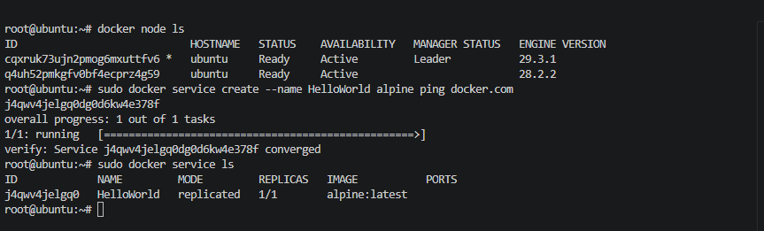
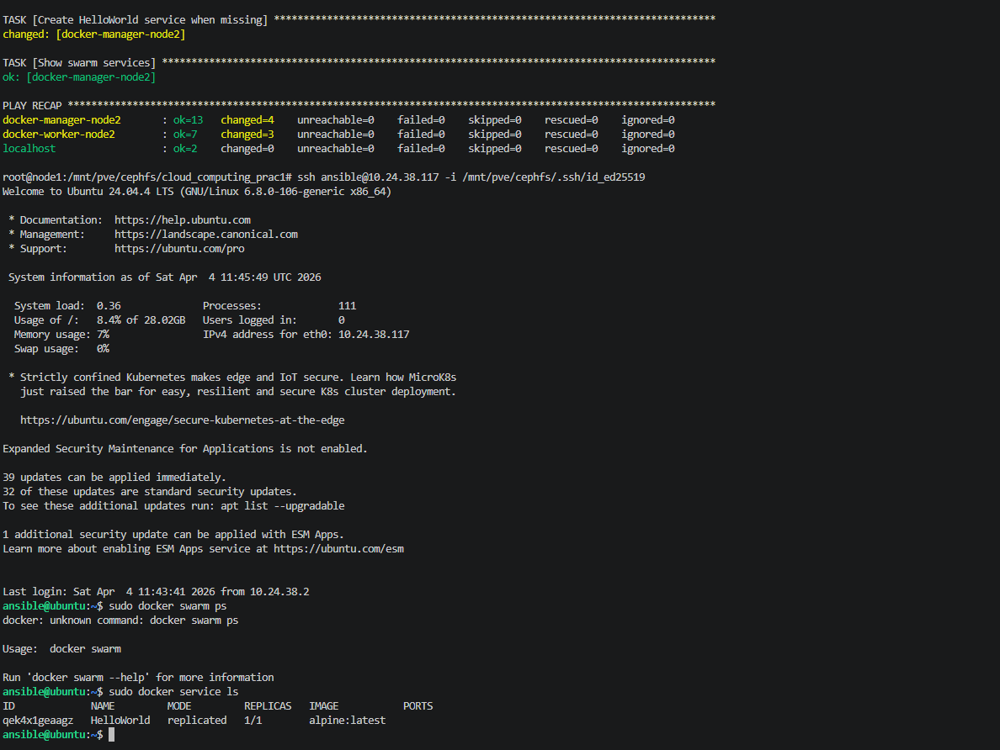

### Geautomatiseerde uitrol van een docker swarm op iedere node

**Config in main.yml**
```
swarm_target_node: node1
docker_swarm_clusters:
  node1:
    manager: docker-manager-node1
    worker: docker-worker-node1
  node2:
    manager: docker-manager-node2
    worker: docker-worker-node2
  node3:
    manager: docker-manager-node3
    worker: docker-worker-node3

vm_instances:
  - vmid: 1113
    name: docker-manager-node1
    ip: 10.24.38.122
    client_user: docker
    target_node: node1
  
  - vmid: 1112
    name: docker-worker-node1
    ip: 10.24.38.123
    client_user: docker
    target_node: node1
  
  - vmid: 1107
    name: docker-manager-node2
    ip: 10.24.38.117
    client_user: docker
    target_node: node2

  - vmid: 1108
    name: docker-worker-node2
    ip: 10.24.38.118
    client_user: docker
    target_node: node2

  - vmid: 1109
    name: docker-manager-node3
    ip: 10.24.38.119
    client_user: docker
    target_node: node3

  - vmid: 1110
    name: docker-worker-node3
    ip: 10.24.38.121
    client_user: docker
    target_node: node3
```

**Clone VM** 
Kloont 6 VM's configureert HA, unieke SSH-keys en voegt toe aan monitoring.

```sh
ansible-playbook ansible/plays/creation/clone_vm.yml --user=ansible --ask-vault-pass --private-key /mnt/pve/cephfs/.ssh/id_ed25519
```

**Setup Docker Swarm**
Installeert Docker en configureert Docker Swarm-cluster voor potentiële containerisatie van services.

```sh
ansible-playbook ansible/plays/inventory_management/setup_docker_swarm.yml --user=ansible --private-key /mnt/pve/cephfs/.ssh/id_ed25519
```

**Working Swarm Commands**
```sh
docker node ls
docker service ls
docker service ps HelloWorld
docker service logs HelloWorld
```

### Bewijs
- 
- 
- [VM Automated Rollout](./AUTOMATED_ROLLOUT_VM.mp4)
- [Docker Swarm node1](./AUTOMATED_SWARM_ROLLOUT_NODE1.mp4)
- [Docker Swarm node2](./AUTOMATED_SWARM_ROLLOUT_NODE2.mp4)
- [Docker Swarm node3](./AUTOMATED_SWARM_ROLLOUT_NODE3.mp4)